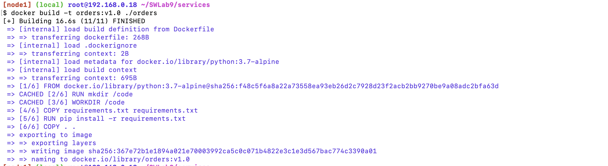
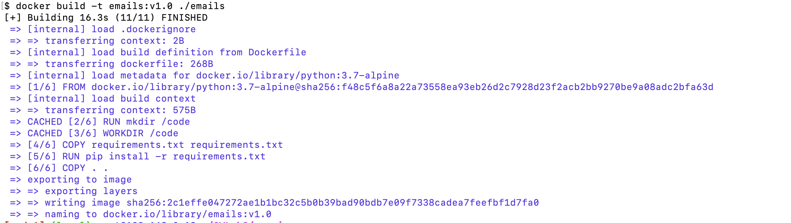
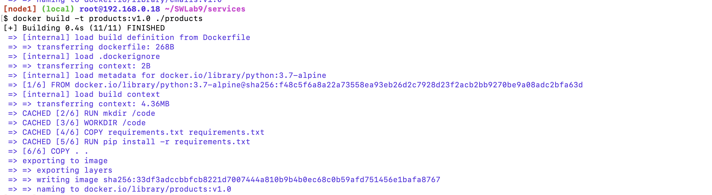
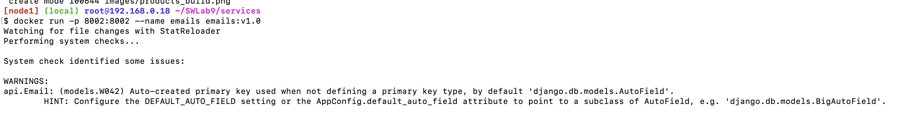

# SWLab9

یک پروژه‌ی اوپن‌سورس ساده‌ی میکرو سرویس انتخاب شده و فرآیند اجرای سرویس‌های مختلف در داکرها به‌صورت مرحله مرحله جلو رفته است.

سورس کد پروژه یک پروژه‌ی با DRF یا Django Rest Framework است که سه سرویس متفاوت دارد. هر کدام از سرویس‌ها API های متفاوتی برای پروژه دارند که یکی مرتبط با ارسال ایمیل‌ها، یکی مرتبط با مدیریت سفارش‌ها و یکی مرتبط با مدیریت محصولات است. 

مشابه دستورالعمل گفته‌شده در ویدیو، در هر کدام از سرویس‌ها مشابه زیر `Dockerfile` را مشخص می‌کنیم (پورت‌های مشخص‌شده در هر کدام از سرویس‌ها متفاوت است):
```
FROM python:3.7-alpine

ENV PYTHONUNBUFFERED 1

RUN mkdir /code

WORKDIR /code

COPY requirements.txt requirements.txt

RUN pip install -r requirements.txt

EXPOSE 8003

COPY . .

CMD ["python3", "manage.py", "runserver", "8003"]
```

بعد از کامل کردن پروژه برای استفاده از داکر از [ابزار معرفی‌شده](https://labs.play-with-docker.com/) استفاده می‌کنیم و بعد از ساختن یک session, instance در این ابزار، پروژه‌ی گیت را در آن کلون می‌کنیم تا بتوانیم آن را داکرایز کنیم.

بعد از آن با کمک دستورات زیر، dockerfile ها را build می‌کنیم:

```
docker build -t orders:v1.0 ./orders
docker build -t emails:v1.0 ./emails
docker build -t products:v1.0 ./products
```


نتیجه‌ی بیلد کردن‌ها را در عکس‌های زیر مشاهده می‌کنید:





بعد از آن با کمک دستورات زیر هر کدام را اجرا می‌کنیم:

```
docker run -p 8002:8002 --name emails emails:v1.0
docker run -p 8001:8001 --name products products:v1.0
docker run -p 8003:8003 --name orders orders:v1.0
```

نتیجه‌ی اجرا کردن دستورات مشابه زیر است:


